# ISMT Cloud Website Deployment 🚀

## Overview

This project demonstrates the deployment of a cloud-hosted educational website on Microsoft Azure using a secure and scalable three-tier infrastructure. The solution was designed to simulate a production-ready cloud environment by integrating networking, compute, storage, security, load balancing, and containerization technologies.

The website was containerized using Docker and deployed within an Azure infrastructure consisting of Virtual Machine Scale Sets (VMSS), Load Balancers, Virtual Networks, Network Security Groups (NSGs), Azure Storage Accounts, and NAT Gateway services.

---

## Project Objectives

* Deploy a web application in a cloud environment
* Implement a secure Azure networking architecture
* Utilize containerization using Docker
* Configure scalable hosting using VM Scale Sets
* Implement traffic distribution using Azure Load Balancer
* Secure infrastructure using NSGs and subnet isolation
* Demonstrate cloud deployment and management best practices

---

## Website Features

* Responsive Homepage
* User Login Interface
* Student Dashboard
* Static HTML, CSS, and JavaScript Front-End
* Containerized Deployment using Docker
* Azure-hosted Infrastructure
* Secure Network Architecture
* Scalable Cloud Deployment

---

## Architecture Diagram

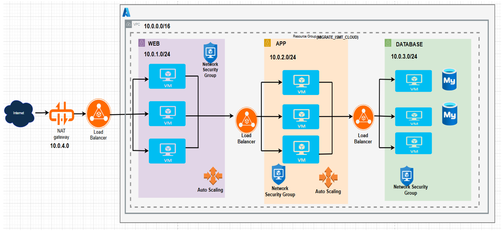

---

## Technology Stack

### Front-End

* HTML5
* CSS3
* JavaScript

### Cloud Platform

* Microsoft Azure

### Containerization

* Docker

### Azure Services

* Resource Groups
* Virtual Networks (VNet)
* Subnets
* NAT Gateway
* Azure Load Balancer
* Virtual Machine Scale Sets (VMSS)
* Network Security Groups (NSGs)
* Azure Bastion
* Azure Storage Account

---

## Project Structure

```text
ISMT-Cloud-Website-Deployment
│
├── index.html
├── login.html
├── dashboard.html
├── login.js
├── style.css
├── Dockerfile
├── architecture-diagram.png
│
├── screenshots
│   ├── resource-group.png
│   ├── virtual-network.png
│   ├── subnets.png
│   ├── nat-gateway.png
│   ├── vmss.png
│   ├── load-balancer.png
│   ├── autoscaling.png
│   ├── nsg-web-tier.png
│   ├── nsg-app-tier.png
│   ├── nsg-db-tier.png
│   ├── bastion.png
│   ├── storage-account.png
│   ├── website-homepage.png
│   ├── login-page.png
│   └── student-dashboard.png
│
└── README.md
```

---

# Azure Infrastructure

## Resource Group

All cloud resources were organized within a dedicated Azure Resource Group to simplify deployment, management, and monitoring.

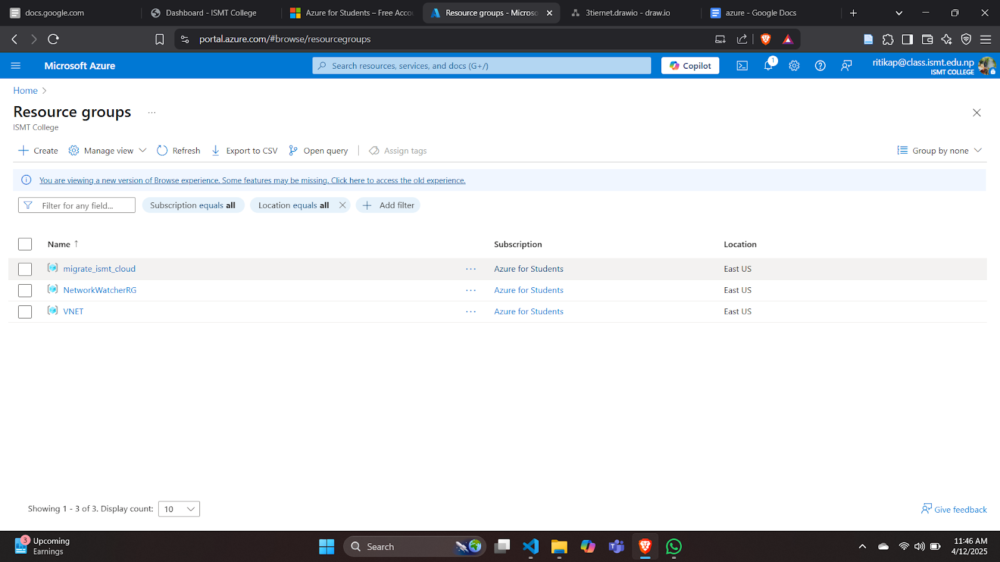

---

## Virtual Network and Subnets

A Virtual Network was created to provide network isolation and segmentation. Dedicated subnets were configured for the Web Tier, Application Tier, Database Tier, and Azure Bastion.

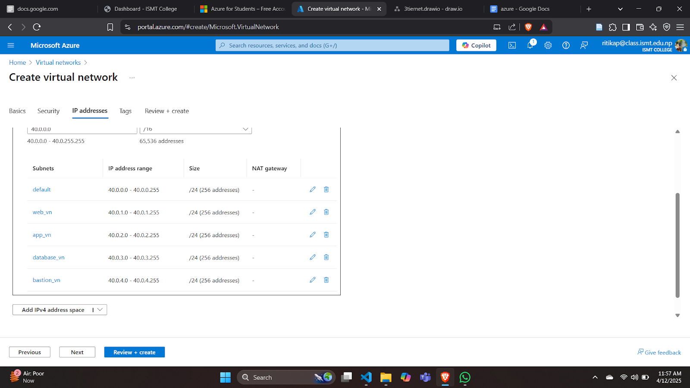

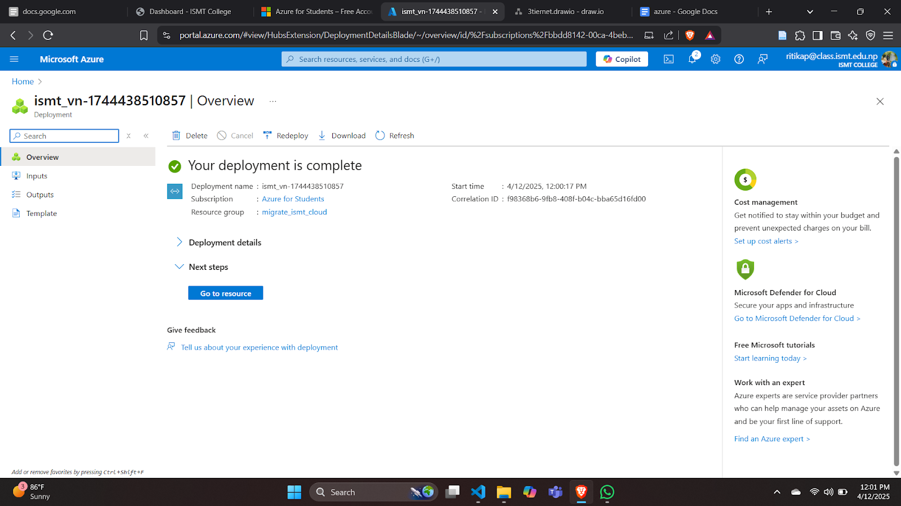

---

## NAT Gateway

A NAT Gateway was configured to provide secure outbound internet access for Azure resources while minimizing direct public exposure.

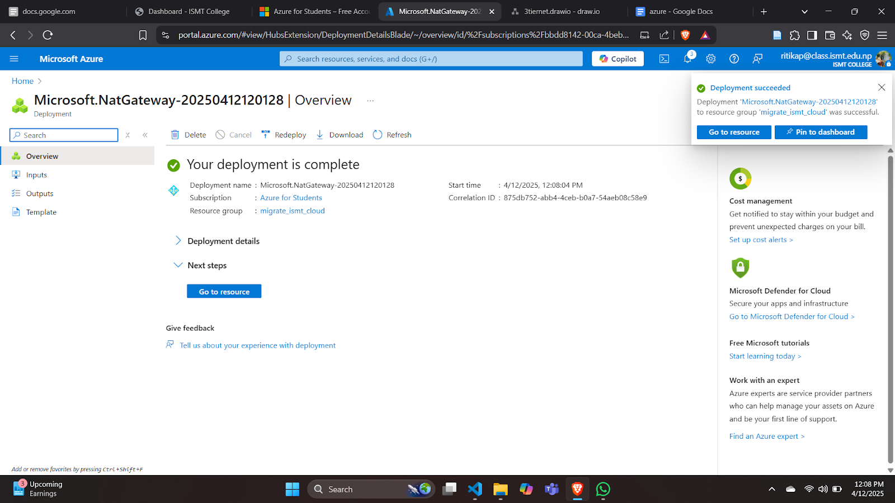

---

## Virtual Machine Scale Set (VMSS)

VM Scale Sets were deployed to provide scalable compute resources capable of automatically responding to varying workloads.

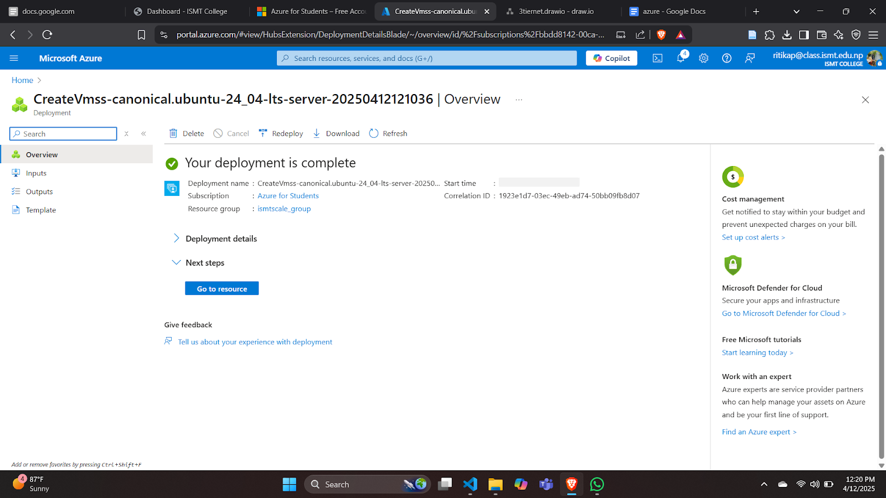

---

## Load Balancer

An Azure Load Balancer was configured to distribute incoming traffic across multiple VM instances, ensuring reliability and fault tolerance.

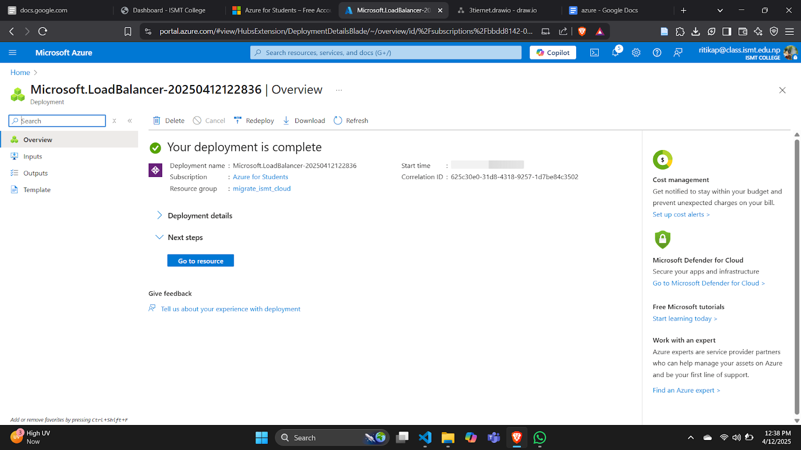

---

## Auto Scaling

Autoscaling policies were implemented to dynamically allocate resources based on demand, improving both performance and cost efficiency.


---

# Security Implementation

## Network Security Groups (NSGs)

NSGs were configured to enforce inbound and outbound traffic rules between infrastructure tiers.

### Web Tier NSG


### Application Tier NSG

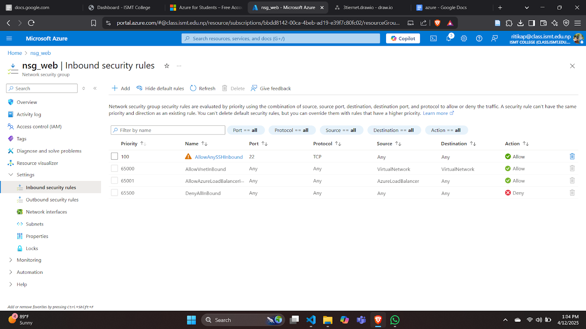

### Database Tier NSG

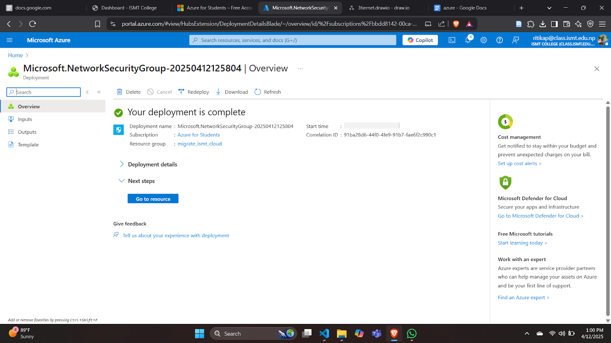

---

## Azure Bastion

Azure Bastion provides secure administrative access to virtual machines without exposing RDP or SSH ports to the public internet.

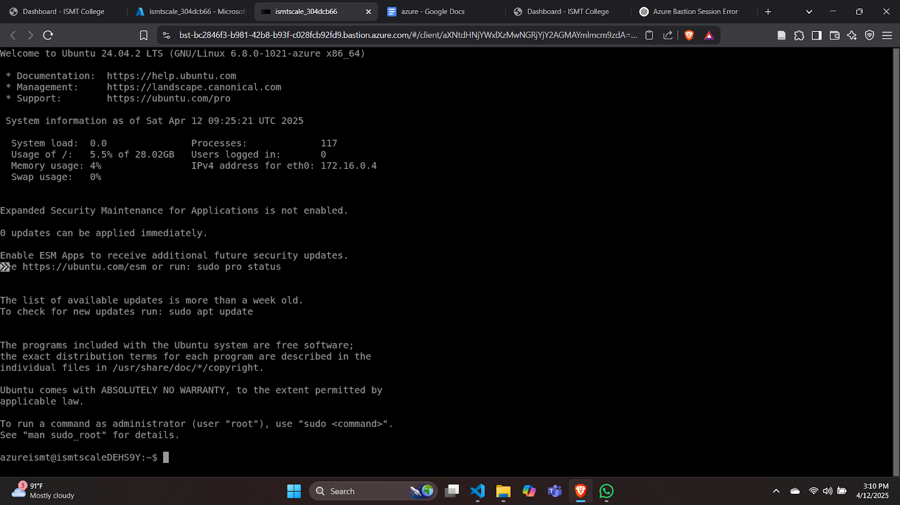

---

## Storage Account

Azure Storage Accounts were used to support application assets and cloud storage requirements.

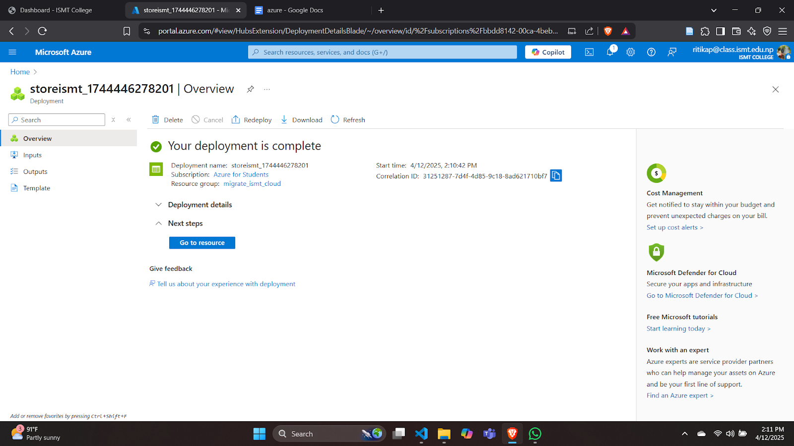

---

# Website Deployment

## Homepage

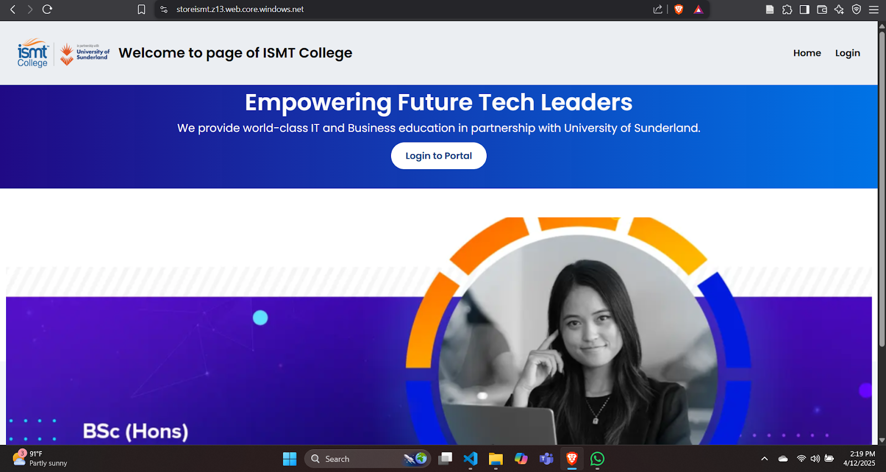

## Login Page

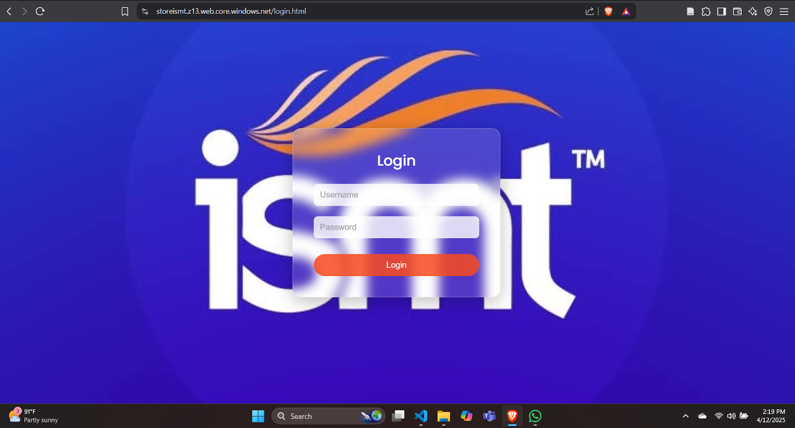

## Student Dashboard

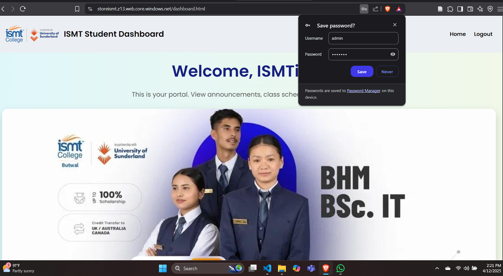

---

# Docker Deployment

Build Docker Image:

```bash
docker build -t ismt-website .
```

Run Docker Container:

```bash
docker run -d -p 80:80 ismt-website
```

Verify Running Containers:

```bash
docker ps
```

---

# Security Features

* Network Segmentation
* Network Security Groups
* Azure Bastion Access
* Tier Isolation
* Controlled Traffic Flow
* Secure Administrative Access
* Reduced Public Exposure

---

# Scalability Features

* Azure VM Scale Sets
* Azure Load Balancer
* Auto Scaling Policies
* Elastic Resource Allocation

---

# Project Outcomes

Successfully implemented:

* Cloud-hosted web application
* Azure networking architecture
* Secure cloud deployment
* Docker containerization
* Load balancing
* Auto scaling
* Cloud security controls
* High availability infrastructure

---

# Future Improvements

* Azure Kubernetes Service (AKS)
* CI/CD using GitHub Actions
* Azure Application Gateway
* Web Application Firewall (WAF)
* Terraform Infrastructure as Code
* Centralized Monitoring and Logging
* Azure Monitor Integration

---

# Author

**Ritika Poudel**

Cloud Computing Project

University of Sunderland

GitHub: https://github.com/Ritika61

---
